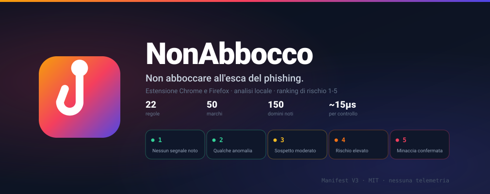

<p align="center">
  
</p>

<p align="center">
  <a href="https://github.com/savez/nonAbbocco/actions/workflows/ci.yml"></a>
  <a href="LICENSE"></a>
  
  
  
</p>

Il phishing non ti frega perché sei distratto: ti frega perché l'indirizzo *sembra* giusto.
`paypal.com.verifica-account.xyz` comincia con "paypal.com", e a colpo d'occhio è quello che leggi.

NonAbbocco guarda l'indirizzo e il contenuto di ogni pagina che apri, assegna un **ranking di
rischio da 1 a 5** e interviene prima che tu digiti le credenziali. Tutto in locale: nessun dato
lascia il browser.

## Cosa riconosce

| | Esempio |
|---|---|
| Marchio nel sottodominio di un dominio altrui | `paypal.com.verifica-account.xyz` |
| Typosquatting sul dominio registrabile | `paypal-secure.xyz`, `inps-rimborso.top` |
| Omografi con alfabeti diversi | `аррӏе.com` scritto in cirillico |
| Alfabeti mescolati dentro la stessa parola | `pаypal.com` con la `а` cirillica |
| Testo civetta prima della chiocciola | `https://paypal.com@evil-collector.xyz` |
| Hosting effimero con TLS valido | `random-kit.pages.dev/signin` |
| Marchio nel sottodominio di una piattaforma condivisa | `paypal.s3.amazonaws.com/login` |
| Credenziali su HTTP in chiaro | qualunque login senza cifratura |
| Indirizzi IP pubblici al posto di un dominio | `http://185.220.101.5/banca/accedi` |

Copre **50 marchi** — banche italiane, Poste, corrieri, INPS, Agenzia delle Entrate, utility,
telco, grandi piattaforme e cripto — ciascuno con l'elenco esplicito dei propri domini legittimi.

## Come decide

Il rank **non** è una somma di punti. Un modello additivo dava lo stesso verdetto a
`paypal-secure.xyz/login` e a `www.posteitaliane.it`: 55 punti entrambi, cioè un attacco da
manuale e il sito vero di Poste trattati allo stesso modo.

Ogni regola alimenta invece una delle quattro categorie, ognuna con un livello di evidenza da 0 a
3, e il rank nasce dalla combinazione:

| Categoria | La domanda a cui risponde |
|---|---|
| `identity` | Chi dice di essere questo sito? |
| `credentials` | Cosa ti sta chiedendo? |
| `transport` | Come lo trasmette? |
| `reputation` | Cosa ne sanno gli altri? |

```
rank 5  ⟸  veto — solo un riscontro di Safe Browsing
rank 4  ⟸  identità ≥ 2  E  credenziali ≥ 1
rank 3  ⟸  identità ≥ 2  O  (identità ≥ 1 E credenziali ≥ 1)  O  (trasporto ≥ 2 E credenziali ≥ 1)
rank 2  ⟸  identità ≥ 1  O  trasporto ≥ 1  O  reputazione ≥ 1
rank 1  ⟸  nessuna evidenza
```

Nota che **le credenziali non compaiono mai da sole**: una pagina che chiede una password non è
per questo sospetta — è la cosa più normale del web. Contano solo in congiunzione. È questa scelta
che ha eliminato i falsi positivi su `posteitaliane.it` e `login.microsoftonline.com`, e che
impedisce di bloccare il router di casa su `192.168.1.1`.

Il processo completo, con i casi svolti, è in **[docs/RANKING.md](docs/RANKING.md)**.

> [!IMPORTANT]
> **Il rank 1 significa «nessun segnale noto», non «sito sicuro».** Il motore è euristico: un kit
> di phishing su un dominio pulito con certificato valido può non attivare alcuna regola. Nessuna
> schermata di NonAbbocco dirà mai che un sito è sicuro, perché sostituire la tua prudenza con una
> falsa certezza farebbe più danni che tacere.

## Cosa vedi

**Sulla pagina.** Sopra la soglia che hai scelto nelle opzioni, un interstiziale a schermo intero
interrompe la navigazione e ti dice cosa è stato osservato. Sotto la soglia, una pillola discreta
in alto a destra con il rank e le anomalie.

**Nelle opzioni.** Oltre alla soglia di blocco, un elenco di **siti sempre attendibili**: su quelli
NonAbbocco non segnala nulla. Una voce copre anche i suoi sottodomini — `esempio.it` vale per
`www.esempio.it` — ma non i domini che se la portano appresso nel nome, come `esempio.it.truffa.xyz`,
che è esattamente la forma d'attacco da riconoscere. L'unica cosa che l'allowlist non mette a tacere
è un riscontro di Safe Browsing: quello è un fatto verificato, non un'euristica.

**Nella barra degli strumenti.** Cliccando l'icona si apre il popup con il verdetto della pagina
corrente: il rank con la sua etichetta, l'indirizzo spezzato sul dominio registrabile — l'unico
pezzo che dice davvero di chi è il sito — le quattro categorie con il loro livello di evidenza, e
l'elenco dei segnali che sono scattati. Quando non è scattato nulla perché il sito è riconosciuto,
il popup dice anche quello.

Il popup **non ricalcola**: legge il verdetto che il background ha già prodotto per quella scheda.
È per questo che il numero nel popup e quello sulla pagina non possono divergere — è lo stesso
numero. Non servono permessi oltre a `storage`.

## Provalo senza installare nulla

La pagina di progetto include un **simulatore interattivo**: costruisci una pagina fittizia e
guarda come reagisce il motore. I verdetti li produce lo stesso codice che gira nell'estensione,
perché la pagina importa `src/scoring.js`.

```bash
git clone https://github.com/savez/nonAbbocco.git && cd nonAbbocco
npx serve .        # poi apri http://localhost:3000/simulator.html
```

Serve un server: la pagina importa un modulo ES, e i moduli non si caricano con `file://`.

## Installazione

L'estensione non è ancora pubblicata sugli store.

<details>
<summary><b>Chrome, Edge, Brave</b></summary>

1. Clona il repository.
2. Apri `chrome://extensions`.
3. Attiva in alto a destra la **Modalità sviluppatore**.
4. **Carica estensione non pacchettizzata** e seleziona la cartella.
5. Regola la soglia di blocco dalle **Opzioni**.

</details>

<details>
<summary><b>Firefox</b></summary>

1. Apri `about:debugging#/runtime/this-firefox`.
2. **Carica componente aggiuntivo temporaneo**.
3. Seleziona `manifest.json`.

Il caricamento temporaneo si azzera alla chiusura del browser.

Serve **Firefox 121 o successivo** per caricare il repository così com'è: il `manifest.json` di
sviluppo dichiara anche il `service_worker` di Chrome, e prima della 121 la sua presenza impediva
alla background page di partire. Gli utenti non sono toccati — il manifest che finisce
nell'archivio per AMO quella chiave non ce l'ha.

</details>

## Privacy

L'analisi è **interamente locale**. Nessuna telemetria, nessun analytics, nessuna chiamata di rete
per stabilire un verdetto. Gli URL che visiti non lasciano il browser e non vengono registrati da
nessuna parte.

L'unica eccezione è opzionale e disattivata per default: **Google Safe Browsing**.

<details>
<summary><b>Se attivi Safe Browsing</b></summary>

Serve una **tua** chiave API, che inserisci nelle opzioni: nel repository non c'è né ci sarà
nessuna chiave. Senza chiave l'estensione funziona identica, con le sole euristiche.

Come funziona il protocollo: l'URL viene canonicalizzato e ridotto a **prefissi di hash SHA-256 di
4 byte**, e sono quelli a viaggiare — non l'indirizzo. Google riceve un prefisso ambiguo, che
corrisponde a moltissimi URL diversi, e non può ricostruire dove stai navigando. La verifica
avviene solo quando le euristiche hanno già prodotto un rank ≥ 3, quindi la maggioranza delle
pagine non genera alcuna richiesta.

Due avvertenze: la Safe Browsing API è **riservata a un uso non commerciale**, e la chiave viene
salvata in `storage.local` — non in `storage.sync` — per non finire sincronizzata sul cloud.

</details>

## Limiti, dichiarati invece che nascosti

- **Su una piattaforma condivisa il dominio non garantisce per il sottodominio.** `s3.amazonaws.com`,
  `awsapps.com`, `storage.googleapis.com`: il dominio è di Amazon o di Google, ma ogni sottodominio
  è di un cliente diverso e non verificato. NonAbbocco lo tiene presente — `miaazienda.awsapps.com`
  passa, `paypal.awsapps.com` no — ma il riconoscimento della piattaforma dipende dalla stessa lista
  di marchi che è il limite qui sotto.
- **La lista dei marchi è il collo di bottiglia e non scala.** Nessuna lista curata a mano coprirà
  i marchi non previsti. Per questo un marchio riconosciuto da solo non produce un rank alto, e per
  questo la copertura ampia è compito di Safe Browsing — una lista che non manteniamo noi.
- **In Manifest V3 non esiste alcun hook di rete bloccante**, quindi la pagina inizia a caricarsi
  prima che il verdetto esista. NonAbbocco non impedisce il caricamento: lo sostituisce con un
  interstiziale entro poche centinaia di millisecondi. Il phishing richiede che tu *legga* e
  *digiti*, e questo è ciò che la finestra chiude.
- **Non intercetta l'esfiltrazione via `fetch()`.** Sarebbe possibile solo iniettando codice nel
  contesto della pagina, cioè in un ambiente controllato dall'attaccante: inaffidabile come
  rilevamento e una superficie d'attacco concreta in cambio. Scelta consapevole.
- **Niente età del dominio né dati WHOIS**: richiederebbero una chiamata di rete nel percorso di
  ogni navigazione, con la latenza e la fuga di privacy che ne seguono.

Usalo come rete di sicurezza aggiuntiva, mai come unica difesa.

## Sviluppo

Nessuna dipendenza da installare, nessuno step di build.

```bash
node --test                  # la suite completa
npm run page                 # rigenera simulator.html
npm run icons                # rigenera le icone PNG
npm run banner               # rigenera il banner del README
npm run update-psl           # riscarica la Public Suffix List
npm run package              # archivi per Chrome e Firefox in dist/
```

```
src/scoring.js      il motore: categorie, saturazione, rank. ESM puro, zero API browser
src/rules.js        le regole come DATI, non come if annidati
src/brands.js       marchi → domini legittimi espliciti
src/psl.js          dominio registrabile via Public Suffix List
src/idn.js          punycode, mixed-script, skeleton dei confondibili
test/corpus/        i due corpus: siti legittimi e pagine di phishing
```

Il **corpus è il contratto**. `benign.json` fissa il rank massimo accettabile per i siti
legittimi, `malicious.json` il minimo richiesto per le pagine di phishing. Una modifica ai pesi
che fa regredire uno dei due rompe la build — è così che si ricalibra il motore senza modello
statistico.

Il contributo più utile non è una regola nuova: è **un caso ben documentato nel corpus**. Dettagli
in [CONTRIBUTING.md](CONTRIBUTING.md).

## Sicurezza

Per segnalare una vulnerabilità **non aprire una issue pubblica**: le istruzioni e il modello di
minaccia sono in [SECURITY.md](SECURITY.md).

## Licenza

[MIT](LICENSE) — Saverio Menin.
